# Amazon Redshift Serverless Data Pipeline Workshop Report
**AWS Data Engineering Internship Assessment**
* **Author:** Juan Ignacio Penazzi
* **Date:** July 2026
* **Workshop Goals:**
  1. **End-to-End Data Warehouse:** Provision an Amazon Redshift Serverless environment, load a dataset from S3 using the `COPY` command, resolve business questions using analytical SQL, and export an aggregated summary back to the `analytics/` layer of the Data Lake.
  2. **AWS Services Integration:** Connect S3 (and Glue Curated) with Redshift Serverless and IAM roles to execute the full `COPY` / query / `UNLOAD` cycle. Understand critical serverless components including Namespace, Workgroup, RPU, and the utility of Data Sharing.

---

## Overview
This technical report details the implementation of an end-to-end data analytics pipeline using Amazon Redshift Serverless to ingest, analyze, and unload commercial real estate listings in the City of Buenos Aires for the year 2020. Raw properties data was processed and stored in a curated layer in Apache Parquet format on Amazon S3. The curated data was then bulk-loaded into Redshift Serverless, where analytical SQL queries were executed to answer critical business questions. Finally, the aggregated insights were exported back to the S3 analytics layer using the `UNLOAD` utility. This pipeline demonstrates how modern, serverless cloud data warehouses scale efficiently, decoupling storage from compute while offering high-performance analytical processing.

---

## Architecture
The environment utilizes a modern serverless architecture on AWS. By separating compute from storage, the pipeline scales dynamically depending on active analytical workloads, eliminating idle cluster costs.

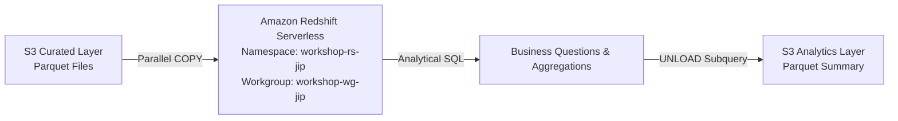

### Infrastructure Components & Parameters:
* **Amazon Redshift Serverless Environment:**
  * **Namespace Name:** `workshop-rs-jip` (Manages data storage, metadata catalogs, schemas, tables, users, and IAM role association).
  * **Workgroup Name:** `workshop-wg-jip` (Manages compute resources, network connectivity, VPC subnets, security groups, and endpoints).
  * **Base Capacity:** Configured at **4 RPUs** (Redshift Processing Units) to balance processing power and cost efficiency for a small-to-medium dataset.
* **IAM Role Permissions:**
  * The role `AWSRedshiftServerless-WorkshopRedshift` (ARN: `arn:aws:iam::955030484229:role/AWSRedshiftServerless-WorkshopRedshift`) is associated with the namespace.
  * Policy constraints restrict access to read/write from/to the specific bucket `s3://workshop-redshift-jip`.
* **Security & Network Configuration:**
  * The workgroup is deployed within a secure VPC across multiple subnets, with inbound security group rules configured to allow secure access through the AWS Console's **Query Editor v2**.

<p align="center">
  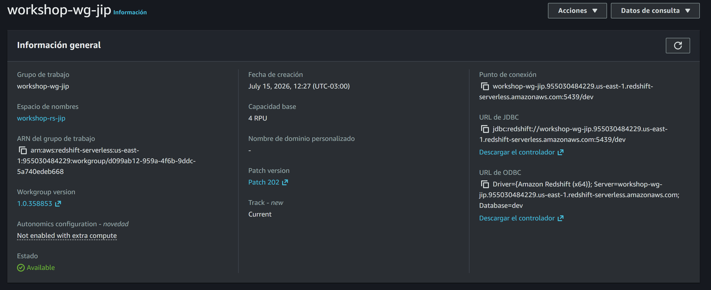
</p> 
<p align="center">
  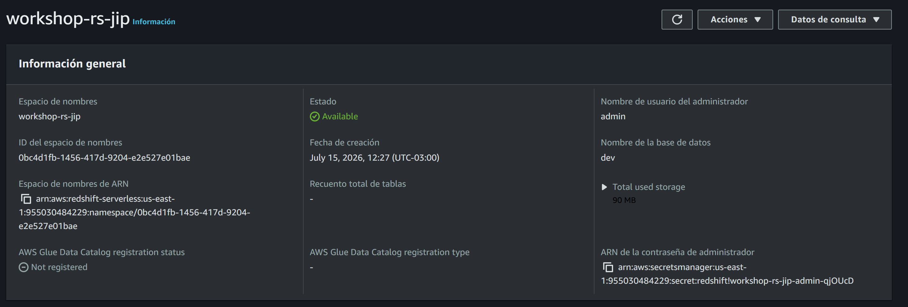
</p> 


---

## Data sources
The dataset analyzed in this project is **locales-en-venta-2020**, representing commercial real estate listings in Buenos Aires.
* **Source Path (S3 Data Lake):** `s3://workshop-redshift-jip/curated/locales-en-venta/`
* **Format:** Apache Parquet (compressed, columnar storage, Hive partitioned).
* **Ingestion Context:** The raw data was originally cleaned and curated from a CSV file (`locales-en-venta-2020.csv`), removing corrupt records and formatting inconsistencies, before being written to the S3 data lake's `curated/` layer as Parquet. Parquet's metadata-rich structure optimizes Redshift's query engine during scans, significantly reducing data transfer between S3 and the compute nodes.

---

## Data dictionary
The table `workshop.locales_en_venta` was designed using explicit typing to match the properties of the curated Parquet files.

| Column Name | SQL Data Type | Description |
| :--- | :--- | :--- |
| `direccion` | `VARCHAR(256)` | Street address of the commercial property |
| `superficie_m2` | `INTEGER` | Total area of the property in square meters |
| `preciousd` | `DOUBLE PRECISION` | Property price listed in US Dollars (USD) |
| `preciopeso` | `DOUBLE PRECISION` | Property price listed in Argentine Pesos (ARS) |
| `usdm2` | `DOUBLE PRECISION` | Property price per square meter in USD |
| `pesosm2` | `DOUBLE PRECISION` | Property price per square meter in ARS |
| `antiguedad` | `INTEGER` | Age of the building/property in years |
| `en_galeria` | `VARCHAR(50)` | Indicates if the local is inside a gallery ("SI" or "NO") |
| `cotizacion` | `DOUBLE PRECISION` | Exchange rate of USD to ARS used for the listing |
| `trimestre` | `VARCHAR(50)` | Quarter of the year the property was listed |
| `barrios` | `VARCHAR(128)` | Neighborhood where the property is located |
| `comuna` | `INTEGER` | Buenos Aires Commune number (1 to 15) |

### Optimization & Physical Design:
* **Distribution Style (`DISTSTYLE AUTO`):** Allows Redshift to dynamically assign the best distribution strategy based on table size and query execution plans.
* **Sort Key (`SORTKEY (barrios)`):** Physically orders the rows by the `barrios` column on disk. This layout significantly speeds up queries filtering or grouping by neighborhood, as the query engine can skip entire blocks of non-matching data.

---

## Load
Ingesting the curated dataset into the data warehouse was done via a parallel bulk load.

### Schema and Table Creation (DDL)
```sql
CREATE SCHEMA IF NOT EXISTS workshop;
SET search_path TO workshop;

CREATE TABLE workshop.locales_en_venta (
  direccion       VARCHAR(256),
  superficie_m2   INTEGER,
  preciousd       DOUBLE PRECISION,
  preciopeso      DOUBLE PRECISION,
  usdm2           DOUBLE PRECISION,
  pesosm2         DOUBLE PRECISION,
  antiguedad      INTEGER,
  en_galeria      VARCHAR(50),
  cotizacion      DOUBLE PRECISION,
  trimestre       VARCHAR(50),
  barrios         VARCHAR(128),
  comuna          INTEGER
)
DISTSTYLE AUTO
SORTKEY (barrios);
```

> [!IMPORTANT]
> **Spectrum Scan Error code: 15007 Prevention:**
> During DDL design, numerical columns for prices and averages were defined using `DOUBLE PRECISION` instead of `DECIMAL`. Because Parquet enforces a strict schema-on-write typing system, any scale or precision mismatch between the underlying Parquet metadata and Redshift's table schema triggers a Spectrum runtime type casting failure (`Spectrum Scan Error code: 15007`). Mapping floating-point numbers directly to `DOUBLE PRECISION` ensures strict schema compatibility.

### Bulk Ingestion Command
```sql
COPY workshop.locales_en_venta
FROM 's3://workshop-redshift-jip/curated/locales-en-venta/'
IAM_ROLE 'arn:aws:iam::955030484229:role/AWSRedshiftServerless-WorkshopRedshift'
FORMAT AS PARQUET;
```
* **Bulk Load Benefit:** The `COPY` command leverages Redshift’s MPP (Massively Parallel Processing) architecture. Instead of inserting records sequentially (row-by-row), Redshift reads multiple Parquet files from S3 in parallel, maximizing network bandwidth and accelerating ingestion.

### Load Validation Queries
To ensure data integrity post-ingestion, the following verification commands were executed:

```sql
-- Count total records loaded
SELECT COUNT(*) AS total_filas FROM workshop.locales_en_venta;

-- View sample rows
SELECT * FROM workshop.locales_en_venta LIMIT 10;
```

**Connection Verification Output showing database, active user, and Redshift engine version:**
<p align="center">
  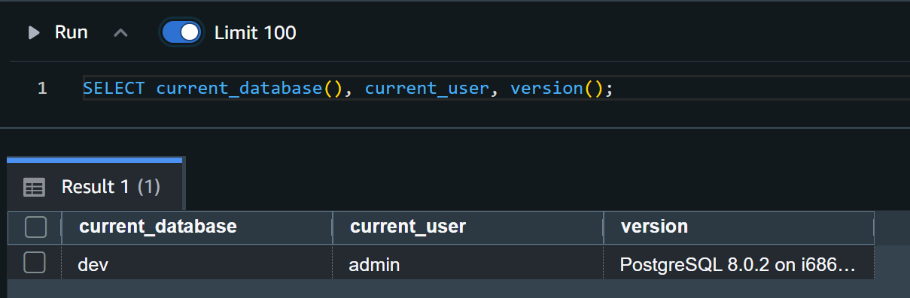
</p> 

**Query Editor v2 displaying the COPY execution log and the successful loading of 6,528 records:**
<p align="center">
  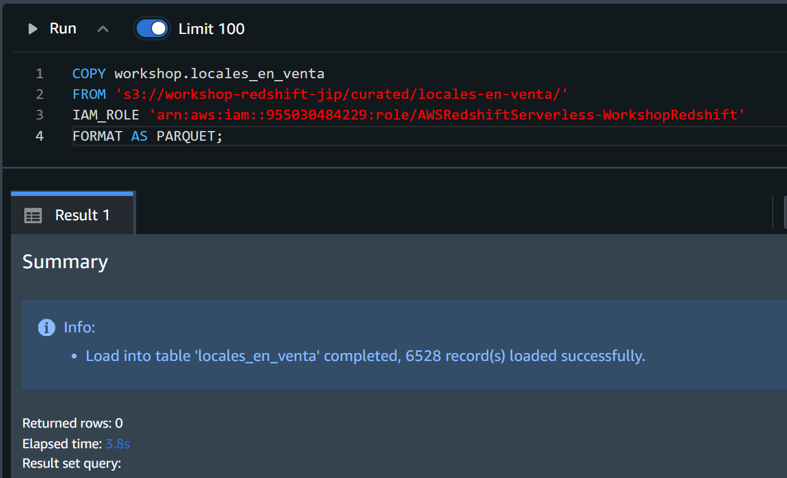
</p> 


**Verification query output showing count of rows and a preview of the first 10 rows loaded from S3**
<p align="center">
  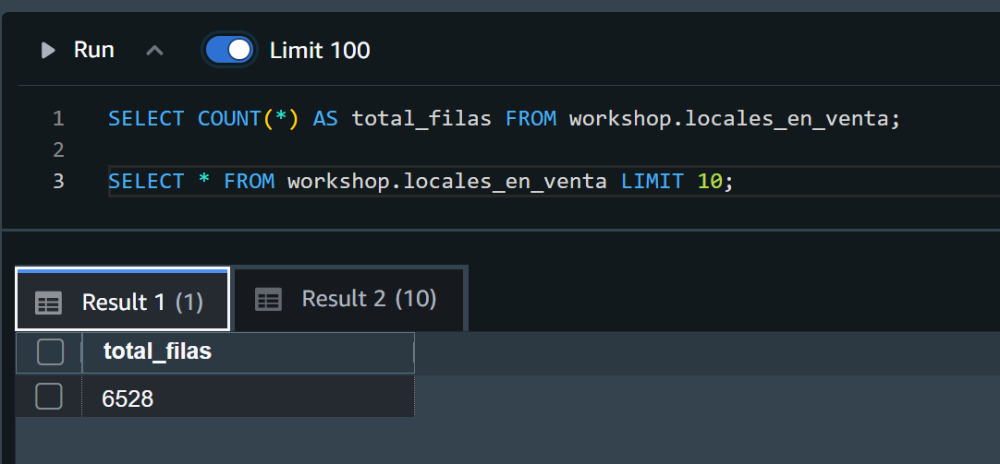
</p> 

<p align="center">
  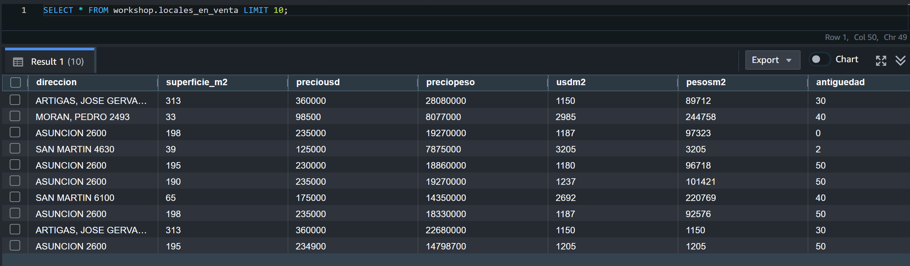
</p> 

---

## Business questions
Three analytical business queries were executed in Redshift to extract insights from the Buenos Aires commercial real estate listings.

### Query 1: Top 10 neighborhoods by average price per square meter
* **Objective:** Identify the 10 most expensive neighborhoods in USD per square meter, filtering out listings smaller than 20 m² to exclude outliers.
* **SQL Code:**
```sql
-- Top 10 barrios con mayor precio promedio por m2 (solo locales mayores a 20 m2)
SELECT 
  barrios,
  COUNT(*) AS cantidad_locales,
  TRUNC(AVG(usdm2), 2) AS precio_promedio_usdm2,
  AVG(superficie_m2) AS superficie_promedio_m2
FROM workshop.locales_en_venta
WHERE superficie_m2 > 20 AND usdm2 IS NOT NULL
GROUP BY barrios
ORDER BY precio_promedio_usdm2 DESC
LIMIT 10;
```

<p align="center">
  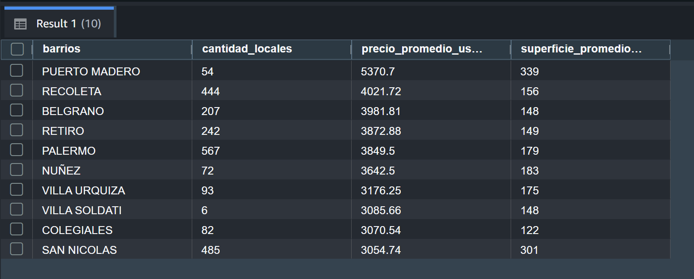
</p> 

---

### Query 2: Market volume and gallery distribution by Commune
* **Objective:** Calculate the total number of listings, the count of properties situated inside commercial galleries, and the total market volume in USD for each Commune.
* **SQL Code:**
```sql
-- Cantidad total de locales y cuántos están en galería por comuna 
SELECT 
  comuna,
  COUNT(*) AS total_locales,
  SUM(CASE WHEN en_galeria = 'SI' THEN 1 ELSE 0 END) AS locales_en_galeria,
  SUM(preciousd) AS volumen_total_ofertado_usd
FROM workshop.locales_en_venta
WHERE preciousd > 0
GROUP BY comuna
ORDER BY comuna ASC;
```

<p align="center">
  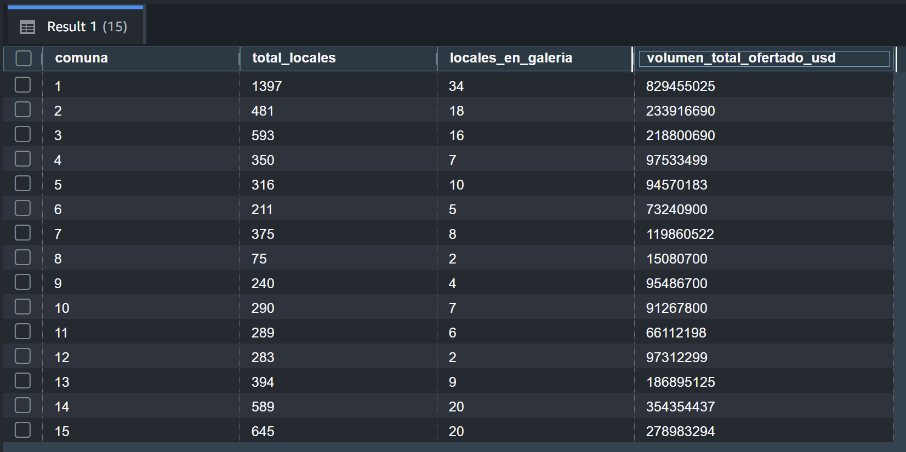
</p> 

---

### Query 3: Neighborhood prices compared to their Commune average
* **Objective:** Compare the average USD per square meter price of each neighborhood against the overall average price of the Commune it belongs to.
* **SQL Code:**
```sql
-- Comparación del precio promedio por barrio frente al promedio general de su comuna
WITH PromedioComuna AS (
  SELECT 
    comuna, 
    TRUNC(AVG(usdm2),2) AS promedio_comuna_usdm2
  FROM workshop.locales_en_venta
  WHERE usdm2 IS NOT NULL
  GROUP BY comuna
)
SELECT 
  l.barrios,
  l.comuna,
  TRUNC(AVG(l.usdm2), 2) AS promedio_barrio_usdm2,
  pc.promedio_comuna_usdm2
FROM workshop.locales_en_venta l
JOIN PromedioComuna pc ON l.comuna = pc.comuna
WHERE l.usdm2 IS NOT NULL
GROUP BY l.barrios, l.comuna, pc.promedio_comuna_usdm2
ORDER BY promedio_barrio_usdm2 DESC
LIMIT 10;
```

<p align="center">
  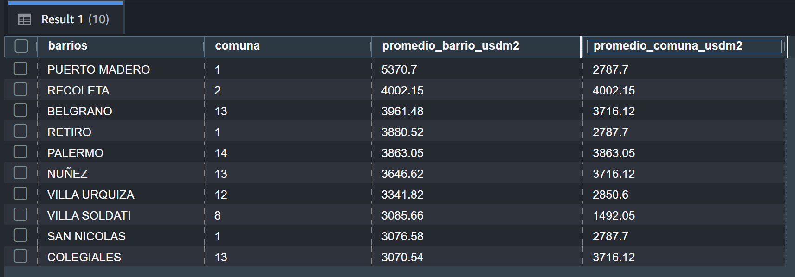
</p> 

---

## Unload
To close the analytical loop and make the structured insights available to downstream processes, the Top 10 neighborhood summary (from Query 1) was exported back to the S3 Data Lake.

### Export Command
```sql
UNLOAD ('
  SELECT * FROM (
    SELECT 
      barrios,
      COUNT(*) AS cantidad_locales,
      TRUNC(AVG(usdm2), 2) AS precio_promedio_usdm2,
      AVG(superficie_m2) AS superficie_promedio_m2
    FROM workshop.locales_en_venta
    WHERE superficie_m2 > 20 AND usdm2 IS NOT NULL
    GROUP BY barrios
    ORDER BY precio_promedio_usdm2 DESC
    LIMIT 10
  )
')
TO 's3://workshop-redshift-jip/analytics/redshift/'
IAM_ROLE 'arn:aws:iam::955030484229:role/AWSRedshiftServerless-WorkshopRedshift'
FORMAT AS PARQUET
ALLOWOVERWRITE;
```

> [!IMPORTANT]
> **LIMIT Clause Workaround in UNLOAD:**
> Redshift's distributed `UNLOAD` command does not natively support placing a `LIMIT` clause in the outer query block. To bypass this limitation and successfully export only the top 10 records, the analytical query was wrapped inside a subquery (`SELECT * FROM (...)`). This compiles the sorting and limit operations first within the compute cluster before streaming the resulting partition to S3.

### Justification for Exporting to the Data Lake:
* **Decoupled Downstream Consumption:** Exporting structured aggregations back to S3 makes them accessible to non-warehouse tools (e.g., Amazon Athena for ad-hoc serverless queries, AWS Glue for cataloging, SageMaker for machine learning, or external BI dashboards) without putting continuous query load on the Redshift serverless workgroup.
* **Storage Cost Optimization:** Storing historical aggregated analytical results in S3 is significantly cheaper than keeping detailed tables in Redshift warehouse storage indefinitely.

<p align="center">
  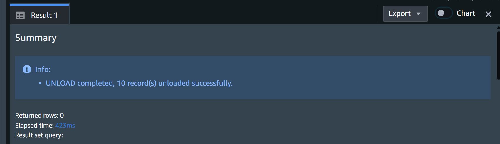
</p> 

---

## Data Sharing
AWS Redshift Data Sharing is a feature that allows secure, live sharing of database objects (schemas, tables, views) across different Redshift namespaces or AWS accounts without physically copying the data.

### Contrast: Data Sharing vs. COPY/UNLOAD Cycle:
* **The COPY/UNLOAD Cycle:** Requires executing an ETL pipeline to export data from a source warehouse, write it to S3, and load it into a target warehouse. This introduces data duplication, pipeline latency, orchestration complexity, and higher storage costs.
* **Data Sharing:** Grants consumers direct, read-only access to live data managed by a producer namespace. There is no data movement, storage is not duplicated, and queries execute using the consumer's own compute resources.

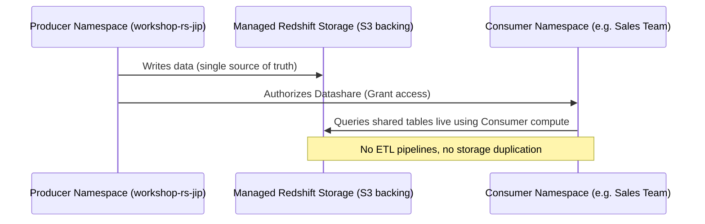

### Corporate & Governance Benefits:
1. **Single Source of Truth:** Changes made by the data engineering team are immediately visible to consumer teams (e.g., Data Science, Finance), eliminating discrepancies caused by outdated files.
2. **Improved Governance:** Data owners can grant, monitor, and revoke access at a granular level (tables/views/schemas) using standard SQL, complying with data privacy regulations.
3. **Decoupled Workloads:** Since consumers use their own serverless workgroups to query the shared data, their intensive analytical queries do not degrade the performance of the producer's production workloads.

---

## How to run
Follow these steps to reproduce the warehouse setup and pipeline execution:

### Step 1: Prepare the S3 Data Lake
1. Create an S3 bucket named `workshop-redshift-jip`.
2. Upload the curated Parquet dataset into the directory: `s3://workshop-redshift-jip/raw/locales-en-venta/`.
3. Clean the dataset with the ETL created in the previus workshop from GLUE.
4. Finally we are going to have the cleaned dataset in: `s3://workshop-redshift-jip/curated/locales-en-venta/`

### Step 2: Configure IAM Permissions
1. Create an IAM Role named `AWSRedshiftServerless-WorkshopRedshift`.
2. Edit the Trust Policy to allow Redshift Serverless to assume the role:
   ```json
   {
     "Version": "2012-10-17",
     "Statement": [
       {
         "Effect": "Allow",
         "Principal": {
           "Service": "redshift-serverless.amazonaws.com"
         },
         "Action": "sts:AssumeRole"
       }
     ]
   }
   ```
3. Attach a policy to allow read/write access to the workshop bucket:
   ```json
   {
     "Version": "2012-10-17",
     "Statement": [
       {
         "Effect": "Allow",
         "Action": [
           "s3:GetObject",
           "s3:ListBucket"
         ],
         "Resource": [
           "arn:aws:s3:::workshop-redshift-jip",
           "arn:aws:s3:::workshop-redshift-jip/*"
         ]
       },
       {
         "Effect": "Allow",
         "Action": [
           "s3:PutObject"
         ],
         "Resource": [
           "arn:aws:s3:::workshop-redshift-jip/analytics/*"
         ]
       }
     ]
   }
   ```

### Step 3: Provision Redshift Serverless
1. Open the Amazon Redshift Console and navigate to **Serverless**.
2. Click **Create workgroup** and configure:
   * **Workgroup Name:** `workshop-wg-jip`
   * **Base RPU:** `4 RPU`
   * **VPC/Subnets:** Select default VPC and subnets.
3. Configure the associated Namespace:
   * **Namespace Name:** `workshop-rs-jip`
   * **IAM Roles:** Associate `AWSRedshiftServerless-WorkshopRedshift`.
4. Wait for the workgroup status to change to **Available**.

### Step 4: Execute SQL Pipeline in Query Editor v2
1. Open **Query Editor v2** and connect to the workgroup.
2. Run the DDL script to create the schema and the `locales_en_venta` table.
3. Run the `COPY` statement to ingest the Parquet files (replace the IAM Role ARN if needed).
4. Execute the verification queries to check the total count (6,528 records).
5. Run the Business Questions queries to compute insights.
6. Execute the `UNLOAD` script to export the aggregated summary back to the S3 bucket.

---

## Summary (español)
Este reporte técnico describe el proceso completo de diseño, carga, consulta y exportación de datos utilizando **Amazon Redshift Serverless**. El proyecto se centró en analizar el conjunto de datos de locales comerciales en venta en la Ciudad de Buenos Aires para el año 2020. 

### Decisiones de Diseño y Supuestos Clave:
1. **Infraestructura Serverless:** Se implementó una separación completa entre la capa de cómputo (Workgroup `workshop-wg-jip` configurado a una capacidad base de 8 RPU) y la capa de datos/metadatos (Namespace `workshop-rs-jip`) para reducir al mínimo los costos y evitar cargos de aprovisionamiento inactivo.
2. **Modelo de Datos:** La tabla se configuró con `DISTSTYLE AUTO` para optimización dinámica y `SORTKEY (barrios)` para reducir el escaneo físico de discos al agrupar o filtrar resultados según la zona geográfica.
3. **Resolución de Errores de Tipos (Spectrum Code 15007):** Se detectó que la lectura estricta de archivos Parquet requería declarar las columnas numéricas de precios y promedios como `DOUBLE PRECISION` en lugar de `DECIMAL`, evitando fallos en tiempo de ejecución por incompatibilidad de escalas decimales.
4. **Exportación con Restricciones:** Debido a que el comando `UNLOAD` de Redshift no admite nativamente la cláusula `LIMIT` en la consulta principal, se diseñó una subconsulta para ordenar e identificar los 10 barrios con mayor precio por metro cuadrado antes de enviar los datos al Data Lake en S3.

### Pasos para la Reproducción:
Para replicar el laboratorio, se debe:
1. Subir los archivos Parquet del dataset a un bucket en S3 (`s3://workshop-redshift-jip/raw/locales-en-venta/`).
2. Ejecutar el ETL creado en el workshop pasado de glue para limpiar el dataset, eliminando duplicados y casteando los tipos de datos.
3. Configurar un rol de IAM con permisos de lectura y escritura acotados al bucket.
4. Crear el Namespace y Workgroup correspondientes en Amazon Redshift Serverless.
5. Ejecutar el DDL de creación de tablas, correr el comando `COPY` para ingesta masiva y ejecutar las consultas analíticas y el comando `UNLOAD` para guardar los resultados analíticos en la capa de `analytics/` en S3.

---

## Cost notes
Understanding billing and architecture boundaries is essential for managing cloud expenses in data warehousing.

### Key Concepts:
* **Redshift Processing Unit (RPU):** RPUs measure the CPU, memory, and network resources utilized by Redshift Serverless to process queries. Compute is billed per **RPU-hour** with per-second billing granularity (minimum charge of 60 seconds per query). When the workgroup is idle (no active queries running), compute costs drop to zero.
* **Storage Billing:** Storage is billed independently from compute and reflects the amount of data persisted in the Namespace (managed storage). It is charged monthly based on gigabytes stored (GB-month).
* **Decoupling Compute & Storage:** The setup splits the architecture into:
  * **Workgroup:** The transient compute layer. It scales automatically to handle peaks and shuts down compute resources during idle times.
  * **Namespace:** The persistent storage and catalog layer. It contains databases, schemas, policies, and system metadata.
* **Implications of Leaving Resources Un-deleted:**
  * If the Workgroup is left active but idle, it does **not** charge for compute (RPU-hours).
  * However, the Namespace will **continuously accumulate storage charges** for the persisted tables on disk. To avoid unexpected charges, both the Workgroup and the Namespace must be deleted when the analytics cluster is no longer needed.

### Athena vs. Redshift Serverless:
* **Amazon Athena:** A serverless query service that queries raw data directly in S3 using a schema-on-read approach. It charges based on the volume of data scanned (typically $5 per TB scanned). It is best for ad-hoc, exploratory queries on raw/unstructured files and infrequent reports.
* **Amazon Redshift Serverless:** A fully-managed data warehouse optimized for complex analytics, low-latency queries, multi-table joins, and high concurrency. It is best suited for structured, indexed data models, heavy dashboard reporting, and operational BI pipelines.

### Transactional Databases (OLTP RDS) vs. Redshift (OLAP):
Running these analytical aggregations (e.g. multi-level averages, full-table groupings, window functions, and CTEs) on a transactional RDS database (like Postgres or MySQL) is highly discouraged:
1. **Resource Starvation:** Analytical workloads execute full-table scans and heavy sorting operations, which consume substantial CPU and Disk I/O, potentially locking tables and disrupting transactional traffic.
2. **Row-oriented vs. Columnar Storage:** OLTP databases store data row-by-row, which is highly efficient for inserting and retrieving single customer records. OLAP databases like Redshift store data column-by-column. For a query like `AVG(usdm2)`, Redshift only reads the `usdm2` column from disk, saving massive amounts of disk I/O and yielding query responses that are orders of magnitude faster.
